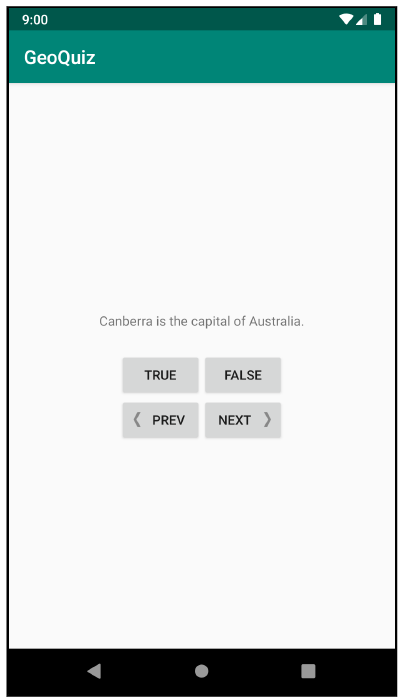

# GeoQuiz Project
The assignment will add a further condition to the GeoQuiz Project that we applied together in the lab today. Thus, the starting point will be from the last thing that we did in GeoQuiz Project.
> Note: If you miss some piece of code through following the lab, you can find the last version of GeoQuiz Project in this assignment.

## Part One - Modify Toast Position
---
- Customize the toast to show at the top instead of the bottom of the screen. To change how the toast is displayed, use the Toast class’s `setGravity` function. Use `Gravity.TOP` for the gravity value. Refer to the developer documentation at [Toast | Android Developer](https://developer.android.com/reference/kotlin/android/widget/Toast#setgravity) for more details.
 
## Part Two - Add a Previous Button
---
- Add a button that the user can press to go back one question. The UI should look something like this
  
  
